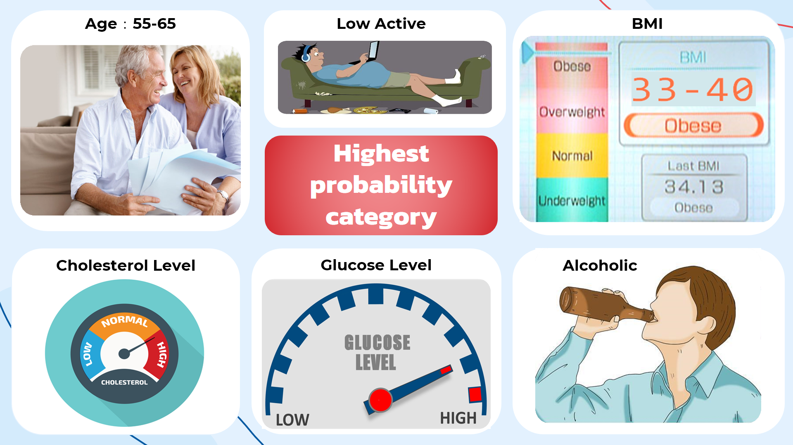

# EE0005 Introduction to Data Science and Artificial Intelligence

## Objective
### Perform Machine Learning to find out which combination has the highest probability of getting cardiovascular disease

## Data Source
Kaggle: [Cardiovascular Disease Dataset](https://www.kaggle.com/datasets/sulianova/cardiovascular-disease-dataset) by [Svetlana Ulianova](https://www.kaggle.com/sulianova)

## Skill Sets that Our Team Apply
- Data Exploratory
- Data Cleaning
- Data Filtering
- Data Visualization
- Machine Learning Applications (Random Forest, XG Boost, etc.)
- Model Evaluation
- Probability Evaluation

## Conclusion
### Highest probability category: age(55-65),BMI(33-40),well-above-normal cholesterol level,well-above-normal glucose level , low active and alcoholic 

## Acknowledgement (Team of 3 members)
- [atyghh](https://github.com/atyghh) 
- Chan Khang Yie
